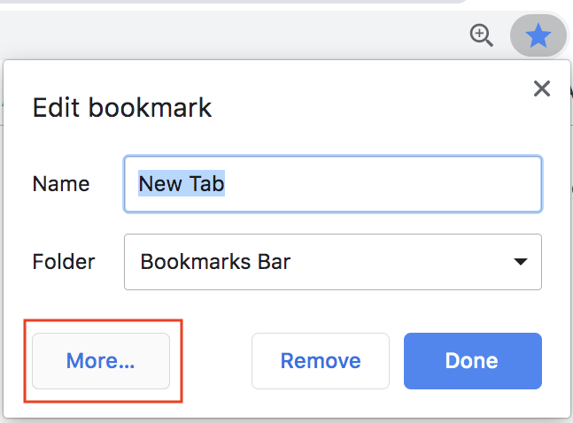
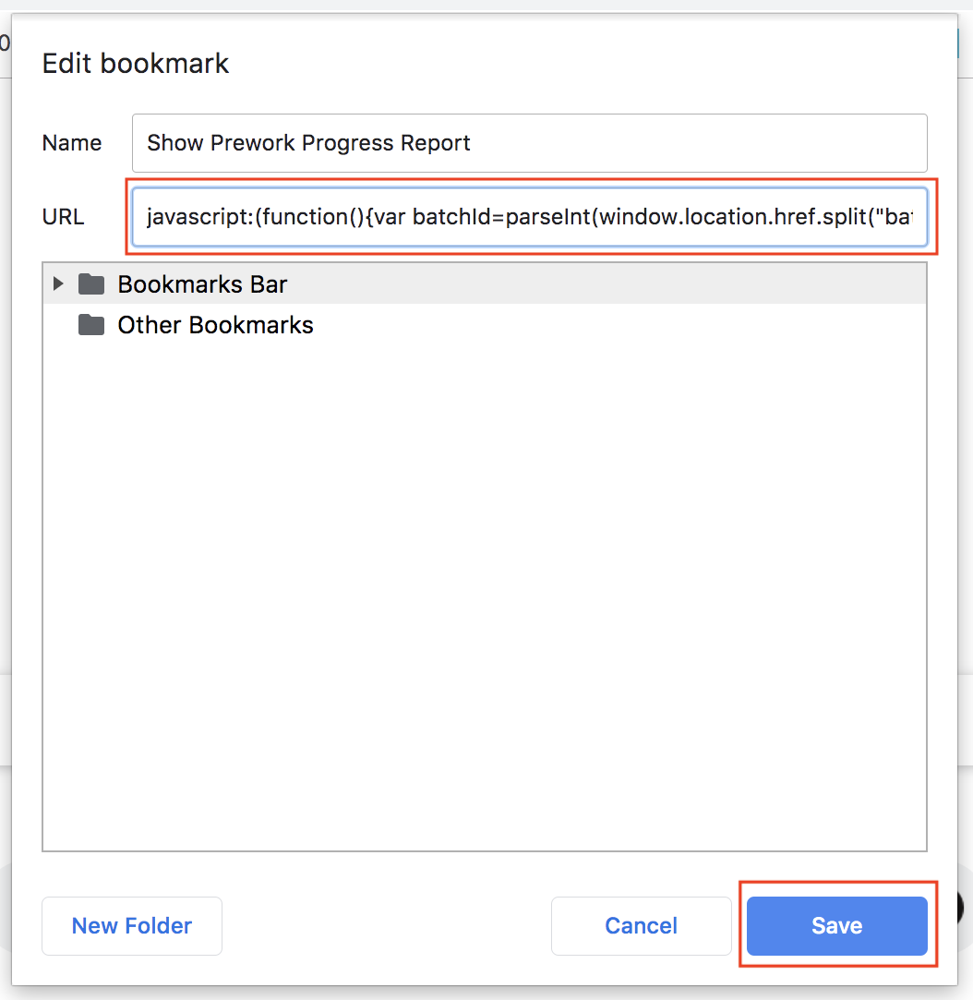
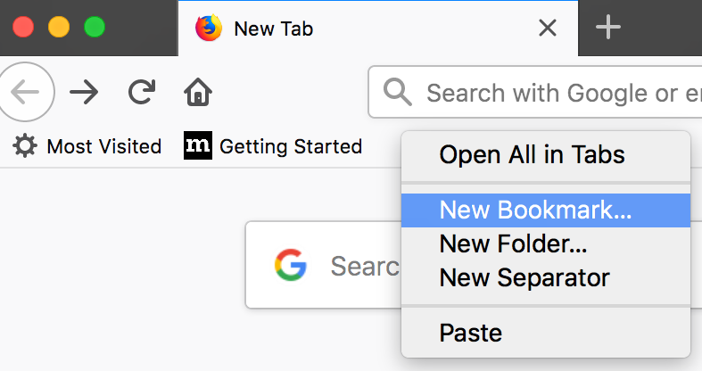
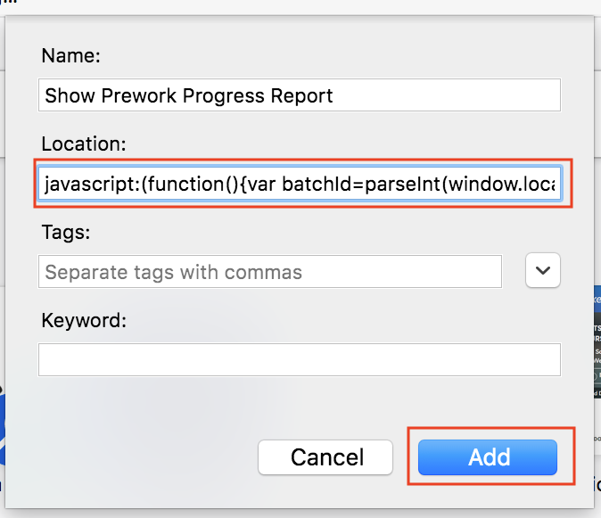
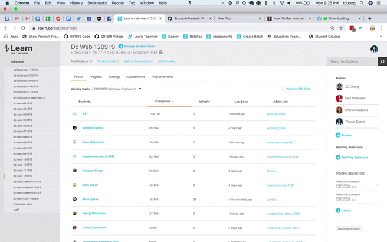

# Student-Prework-Progress-admissions

This tool will allow you to see the PREWORK progress of each individual student in a batch.

The current version of this tool works with the **PREWORK: Software Engineering (fswd-prework-2-01)** track.

## Installation Instructions

Create a new book mark titled `Show Prework Progress Report`. Copy and paste the following into the URL:

```
javascript:(function(){var batchId=parseInt(window.location.href.split("batches/")[1]),trackId=62141,totalLessons=166,errorMessage="\nError Generating Prework Report! Are you on a Learn.co page? Does the URL begin with:\n  https://learn.co/batches/ \n\nNote: This report generator only works with the PREWORK: Software Engineering (fswd-prework-2-01) track. If the Prework has been updated recently, you will need to update this tool.\n";function init(){var e=document.querySelector("#fried-chicken");e||((e=document.createElement("div")).id="fried-chicken",document.querySelector("#main").prepend(e),e.style.cssText="padding: 75px; display: block; position: fixed; z-index: 100; width: 100%; height: 100%; overflow: auto; background-color: rgb(245,245,245)"),e.innerHTML=`<button>Back To Batch View</button><h1>Loading results... <span id="chocolate-bar">0/${totalLessons}</span></h1><div id="penguins"></div><div id="waffles"></div>`,e.querySelector("button").addEventListener("click",()=>{e.style.display="none"}),getLessons()}function getLessons(){var e=`https://learn.co/api/v1/batches/${batchId}/tracks/${trackId}/deployed`,t=fetch(`https://learn.co/api/v1/batches/${batchId}/tracks/${trackId}/progress`).then(e=>e.json()),n=fetch(e).then(e=>e.json());Promise.all([t,n]).then(e=>{getIndividualData(e[0].map(e=>(e.lessons=[],e.num_lessons_completed=0,e)),e[1])})}function getIndividualData(e,t){var n=[],o=0;t.topics.forEach(e=>{e.units.forEach(e=>{e.lessons.forEach(e=>{var t=fetch(`https://learn.co/api/v1/batches/${batchId}/lessons/${e.node.id}`).then(e=>(o++,document.querySelector("#chocolate-bar").innerText=`${o}/${totalLessons}`,e.json()));n.push(t)})})}),Promise.all(n).then(t=>{compileResults(e,t)})}function compileResults(e,t){t.forEach(t=>{t.students.forEach(n=>{let o,a=e.find(e=>e.id===n.id);n.completed_at?(a.num_lessons_completed+=1,o="✅ "):n.started_at&&!n.completed_at?o="💪 ":n.started_at||(o="❌ "),o+=t.title,a.lessons.push(o)})}),printStudentProgress(e)}function printStudentProgress(e){var t=document.querySelector("#penguins");t.innerHTML="<h5>Students:</h5>",addContent("","p"),e.forEach(e=>{var n=document.createElement("p");n.innerHTML=`<a href="#penguin-${e.id}">${e.full_name}</a>: <span>${e.num_lessons_completed}/${totalLessons}<span>`,t.append(n),addContent(`${e.full_name}:`,"h3",`penguin-${e.id}`),e.lessons.forEach(e=>{addContent(e,"p")}),addContent("","p"),addContent('<a href="#penguins">Back To The Top</a>',"p")})}function addContent(e,t,n){var o=document.createElement(t);n&&(o.id=n),o.innerHTML=e,document.querySelector("#waffles").append(o)}Number.isInteger(batchId)&&Number.isInteger(trackId)?init():alert(errorMessage);})()
```

### How to Install in Google Chrome:
1. Create a bookmark from any page by clicking the star by the address bar.


2. Click on the More... button.


3. Click the Save button after filling out the Name and URL.


### How to Install in Microsoft Edge:
* Creating a bookmark in Microsoft Edge is nearly identical to the Chrome instructions above.

### How to Install in Mozilla FireFox:
1. Create a new bookmark.


2. Copy and paste the above code into the Location, then click Save.


## How To Use Instructions

View any batch on Learn.co. Click your new bookmark and wait a few seconds as the page is reloaded and will eventually show each student's progress report. To exit or go back to the batch list, click the Back To Batch View button.

